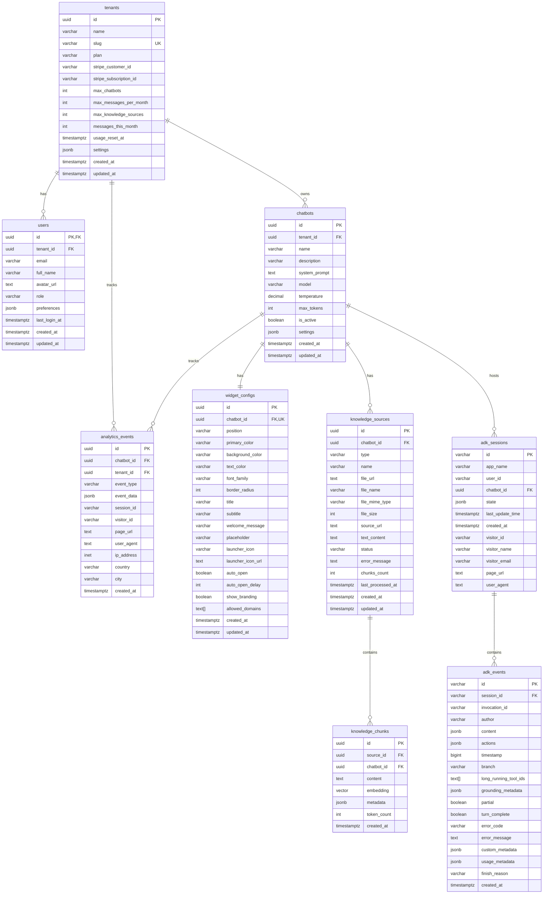
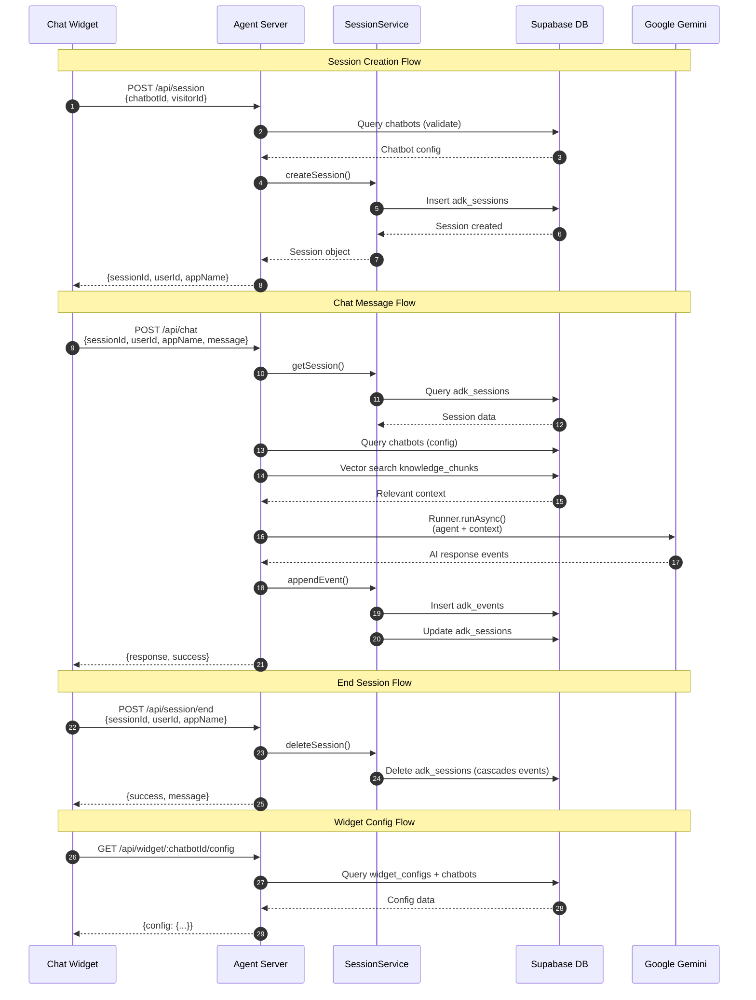
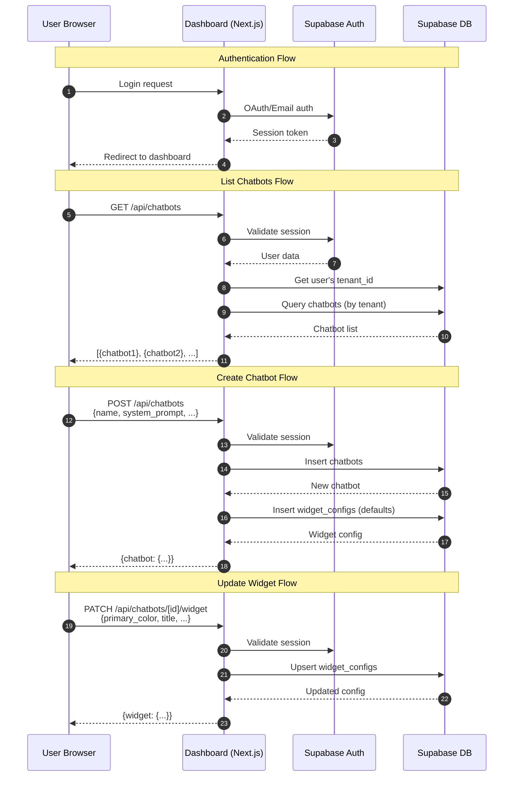
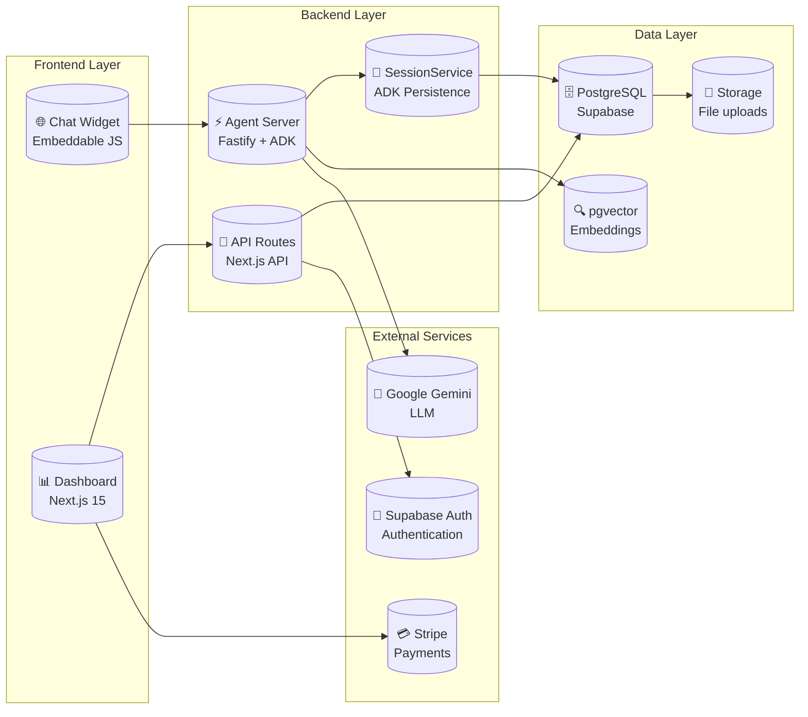
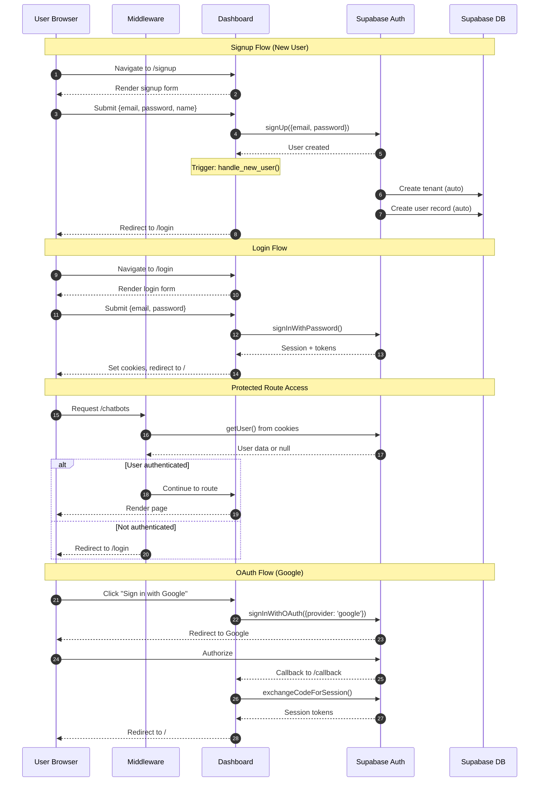
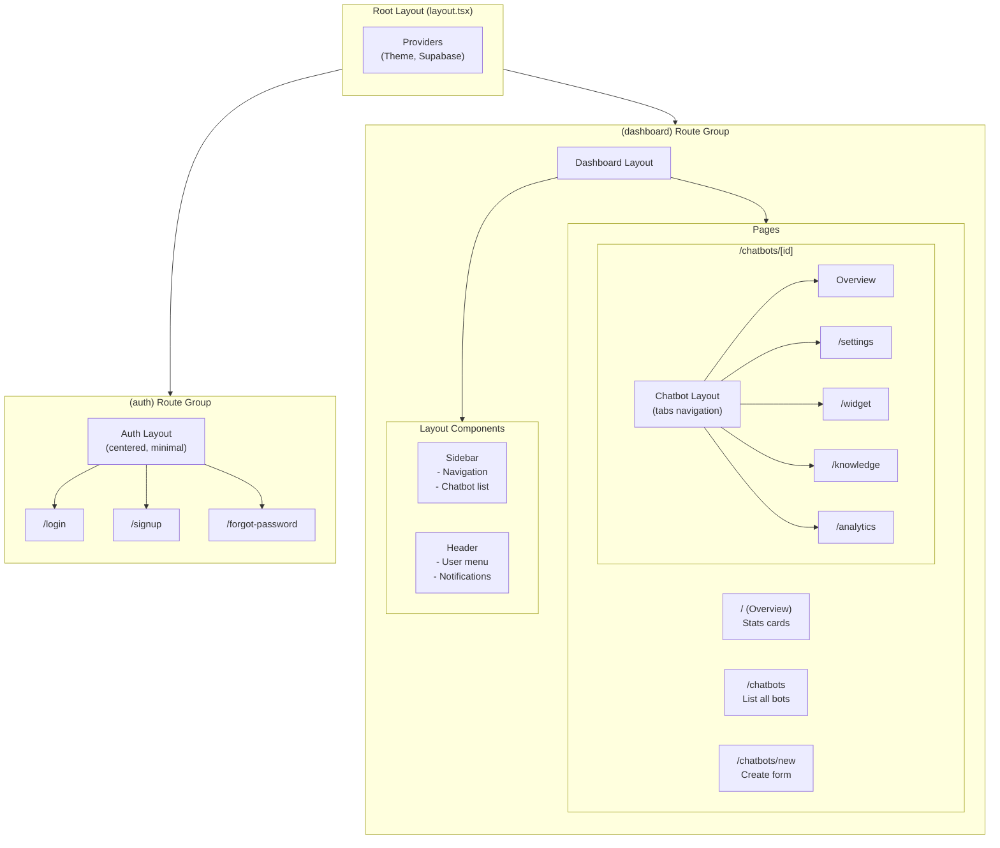

# Project Architecture

## Overview

This is a **multi-tenant chatbot platform** built with:
- **Dashboard**: Next.js 15 with Supabase Auth/PostgREST for the admin interface
- **Agent Server**: Fastify + Google ADK + Drizzle ORM for the chat API
- **Database**: Supabase (PostgreSQL with pgvector extension)
- **Migrations**: Drizzle (`drizzle/`)

---

## Project Directory Structure

```
agent-chat/
├── apps/
│   ├── agent-server/           # Fastify + Google ADK chat server
│   │   ├── config/
│   │   │   ├── cache.ts        # In-memory config cache
│   │   │   ├── loader.ts       # Chatbot/widget config loader
│   │   │   └── supabase.ts     # Supabase admin client
│   │   ├── services/
│   │   │   └── supabase-session-service.ts  # ADK session persistence
│   │   ├── widget/
│   │   │   ├── chat-widget.js  # Embeddable widget script
│   │   │   └── chat-widget.css
│   │   ├── agent.ts            # Base agent definition
│   │   ├── agent-factory.ts    # Dynamic agent creation
│   │   └── server.ts           # Fastify server entry
│   │
│   └── dashboard/              # Next.js 15 admin dashboard
│       └── src/
│           ├── app/
│           │   ├── (auth)/     # Auth route group
│           │   │   ├── login/
│           │   │   ├── signup/
│           │   │   └── forgot-password/
│           │   ├── (dashboard)/ # Protected route group
│           │   │   ├── page.tsx           # Overview/home
│           │   │   ├── layout.tsx         # Dashboard layout
│           │   │   └── chatbots/
│           │   │       ├── page.tsx       # Chatbots list
│           │   │       ├── new/           # Create chatbot
│           │   │       └── [id]/
│           │   │           ├── page.tsx   # Chatbot detail
│           │   │           ├── settings/  # Model settings
│           │   │           ├── widget/    # Widget config
│           │   │           ├── knowledge/ # Knowledge base
│           │   │           └── analytics/ # Analytics
│           │   ├── api/
│           │   │   └── chatbots/
│           │   │       ├── route.ts       # List/Create
│           │   │       └── [id]/
│           │   │           ├── route.ts   # Get/Update/Delete
│           │   │           └── widget/    # Widget config
│           │   └── callback/              # OAuth callback
│           ├── components/
│           │   ├── ui/         # shadcn/ui components
│           │   ├── layout/     # Sidebar, Header
│           │   ├── chatbots/   # Chatbot components
│           │   └── widget/     # Widget config components
│           ├── lib/
│           │   └── supabase/   # Supabase clients
│           └── middleware.ts   # Auth middleware
│
├── packages/
│   └── shared/                 # Shared types package
│       └── src/
│           ├── types/
│           │   ├── agent.ts
│           │   ├── widget.ts
│           │   ├── knowledge.ts
│           │   └── conversation.ts
│           └── database.types.ts  # Generated Supabase types
│
├── supabase/
│   ├── config.toml             # Supabase config
│   └── migrations/             # Database migrations
│
└── docs/
    └── architecture.md         # This file
```

---

## Database Entity Relationship Diagram



---

## API Architecture Diagram

```mermaid
flowchart TB
    subgraph Client["🌐 Client Applications"]
        Widget["Chat Widget<br/>(Embedded JS)"]
        Dashboard["Admin Dashboard<br/>(Next.js)"]
    end

    subgraph AgentServer["⚡ Agent Server (Fastify)"]
        direction TB
        AS_Health["GET /api/health"]
        AS_Session["POST /api/session"]
        AS_SessionEnd["POST /api/session/end"]
        AS_Chat["POST /api/chat"]
        AS_WidgetConfig["GET /api/widget/:chatbotId/config"]
        AS_Reload["POST /api/internal/reload/:chatbotId"]
    end

    subgraph DashboardAPI["📊 Dashboard API (Next.js)"]
        direction TB
        D_ListBots["GET /api/chatbots"]
        D_CreateBot["POST /api/chatbots"]
        D_GetBot["GET /api/chatbots/[id]"]
        D_UpdateBot["PATCH /api/chatbots/[id]"]
        D_DeleteBot["DELETE /api/chatbots/[id]"]
        D_GetWidget["GET /api/chatbots/[id]/widget"]
        D_UpdateWidget["PATCH /api/chatbots/[id]/widget"]
        D_Callback["GET /callback"]
    end

    subgraph Database["🗄️ Supabase (PostgreSQL)"]
        direction TB
        DB_Tenants[(tenants)]
        DB_Users[(users)]
        DB_Chatbots[(chatbots)]
        DB_Widget[(widget_configs)]
        DB_Knowledge[(knowledge_sources)]
        DB_Chunks[(knowledge_chunks)]
        DB_Sessions[(adk_sessions)]
        DB_Events[(adk_events)]
        DB_Analytics[(analytics_events)]
    end

    subgraph AI["🤖 AI Services"]
        Gemini["Google Gemini<br/>(LLM)"]
        Embeddings["Embeddings API<br/>(Vector Search)"]
    end

    %% Client to Server connections
    Widget --> AS_Session
    Widget --> AS_SessionEnd
    Widget --> AS_Chat
    Widget --> AS_WidgetConfig
    Dashboard --> DashboardAPI

    %% Agent Server to Database
    AS_Session --> DB_Chatbots
    AS_Session --> DB_Sessions
    AS_SessionEnd --> DB_Sessions
    AS_Chat --> DB_Sessions
    AS_Chat --> DB_Events
    AS_Chat --> DB_Chunks
    AS_WidgetConfig --> DB_Chatbots
    AS_WidgetConfig --> DB_Widget

    %% Dashboard API to Database
    D_ListBots --> DB_Users
    D_ListBots --> DB_Chatbots
    D_CreateBot --> DB_Chatbots
    D_CreateBot --> DB_Widget
    D_GetBot --> DB_Chatbots
    D_UpdateBot --> DB_Chatbots
    D_DeleteBot --> DB_Chatbots
    D_GetWidget --> DB_Widget
    D_UpdateWidget --> DB_Widget

    %% AI Service connections
    AS_Chat --> Gemini
    AS_Chat --> Embeddings
    Embeddings --> DB_Chunks

    classDef server fill:#4f46e5,stroke:#312e81,color:#fff
    classDef database fill:#059669,stroke:#065f46,color:#fff
    classDef client fill:#f59e0b,stroke:#b45309,color:#fff
    classDef ai fill:#ec4899,stroke:#be185d,color:#fff

    class AS_Health,AS_Session,AS_SessionEnd,AS_Chat,AS_WidgetConfig,AS_Reload,D_ListBots,D_CreateBot,D_GetBot,D_UpdateBot,D_DeleteBot,D_GetWidget,D_UpdateWidget,D_Callback server
    class DB_Tenants,DB_Users,DB_Chatbots,DB_Widget,DB_Knowledge,DB_Chunks,DB_Sessions,DB_Events,DB_Analytics database
    class Widget,Dashboard client
    class Gemini,Embeddings ai
```



---

## API Request Flow Diagram



---

## Dashboard API Flow



---

## System Components Overview



---

## Authentication Flow



---

## Dashboard Layout Structure



---

## Dashboard Pages

| Route | Component | Description |
|-------|-----------|-------------|
| `/login` | `(auth)/login/page.tsx` | Email/password login form |
| `/signup` | `(auth)/signup/page.tsx` | Registration form (creates tenant + user) |
| `/forgot-password` | `(auth)/forgot-password/page.tsx` | Password reset request |
| `/` | `(dashboard)/page.tsx` | Overview with stats cards |
| `/chatbots` | `(dashboard)/chatbots/page.tsx` | List of all chatbots |
| `/chatbots/new` | `(dashboard)/chatbots/new/page.tsx` | Create new chatbot form |
| `/chatbots/[id]` | `(dashboard)/chatbots/[id]/page.tsx` | Chatbot overview/detail |
| `/chatbots/[id]/settings` | `(dashboard)/chatbots/[id]/settings/page.tsx` | Model config (temperature, etc.) |
| `/chatbots/[id]/widget` | `(dashboard)/chatbots/[id]/widget/page.tsx` | Widget customization |
| `/chatbots/[id]/knowledge` | `(dashboard)/chatbots/[id]/knowledge/page.tsx` | Knowledge base management |
| `/chatbots/[id]/analytics` | `(dashboard)/chatbots/[id]/analytics/page.tsx` | Usage analytics |

---

## Model Relationships Summary

| Relationship | Type | Description |
|-------------|------|-------------|
| `tenants` → `users` | **One-to-Many** | A tenant has multiple users |
| `tenants` → `chatbots` | **One-to-Many** | A tenant owns multiple chatbots |
| `tenants` → `analytics_events` | **One-to-Many** | Tenant-level analytics |
| `users` → `auth.users` | **One-to-One** | Extends Supabase auth |
| `chatbots` → `widget_configs` | **One-to-One** | Each chatbot has one widget config |
| `chatbots` → `knowledge_sources` | **One-to-Many** | A chatbot has multiple knowledge sources |
| `chatbots` → `adk_sessions` | **One-to-Many** | A chatbot has multiple ADK sessions |
| `chatbots` → `analytics_events` | **One-to-Many** | Chatbot-level analytics |
| `knowledge_sources` → `knowledge_chunks` | **One-to-Many** | Source split into chunks |
| `adk_sessions` → `adk_events` | **One-to-Many** | Session contains conversation events |

---

## API Endpoints Summary

### Agent Server (`/apps/agent-server`)

| Method | Endpoint | Purpose |
|--------|----------|---------|
| `GET` | `/api/health` | Health check |
| `POST` | `/api/session` | Create new chat session |
| `POST` | `/api/session/end` | End and delete a chat session |
| `POST` | `/api/chat` | Send message and get AI response |
| `GET` | `/api/widget/:chatbotId/config` | Get widget configuration |
| `POST` | `/api/internal/reload/:chatbotId` | Reload chatbot config (internal) |

### Dashboard API (`/apps/dashboard`)

| Method | Endpoint | Purpose |
|--------|----------|---------|
| `GET` | `/api/chatbots` | List all chatbots for tenant |
| `POST` | `/api/chatbots` | Create new chatbot |
| `GET` | `/api/chatbots/[id]` | Get single chatbot |
| `PATCH` | `/api/chatbots/[id]` | Update chatbot |
| `DELETE` | `/api/chatbots/[id]` | Delete chatbot |
| `GET` | `/api/chatbots/[id]/widget` | Get widget config |
| `PATCH` | `/api/chatbots/[id]/widget` | Update widget config |
