# Project Architecture

## Overview

This is a **multi-tenant chatbot platform** built with:
- **Dashboard**: Next.js 15 with Supabase Auth/PostgREST for the admin interface
- **Agent Server**: Fastify + Google ADK + Drizzle ORM for the chat API
- **Database**: Supabase (PostgreSQL with pgvector extension)
- **Migrations**: Drizzle (`drizzle/`)

---

## Project Directory Structure

```
agent-chat/
├── apps/
│   ├── agent-server/           # Fastify + Google ADK chat server
│   │   ├── config/
│   │   │   ├── cache.ts        # In-memory config cache
│   │   │   ├── loader.ts       # Chatbot/widget config loader
│   │   │   └── supabase.ts     # Supabase admin client
│   │   ├── services/
│   │   │   └── supabase-session-service.ts  # ADK session persistence
│   │   ├── widget/
│   │   │   ├── chat-widget.js  # Embeddable widget script
│   │   │   └── chat-widget.css
│   │   ├── agent.ts            # Base agent definition
│   │   ├── agent-factory.ts    # Dynamic agent creation
│   │   └── server.ts           # Fastify server entry
│   │
│   └── dashboard/              # Next.js 15 admin dashboard
│       └── src/
│           ├── app/
│           │   ├── (auth)/     # Auth route group
│           │   │   ├── login/
│           │   │   ├── signup/
│           │   │   └── forgot-password/
│           │   ├── (dashboard)/ # Protected route group
│           │   │   ├── page.tsx           # Overview/home
│           │   │   ├── layout.tsx         # Dashboard layout
│           │   │   └── chatbots/
│           │   │       ├── page.tsx       # Chatbots list
│           │   │       ├── new/           # Create chatbot
│           │   │       └── [id]/
│           │   │           ├── page.tsx   # Chatbot detail
│           │   │           ├── settings/  # Model settings
│           │   │           ├── widget/    # Widget config
│           │   │           ├── knowledge/ # Knowledge base
│           │   │           └── analytics/ # Analytics
│           │   ├── api/
│           │   │   └── chatbots/
│           │   │       ├── route.ts       # List/Create
│           │   │       └── [id]/
│           │   │           ├── route.ts   # Get/Update/Delete
│           │   │           └── widget/    # Widget config
│           │   └── callback/              # OAuth callback
│           ├── components/
│           │   ├── ui/         # shadcn/ui components
│           │   ├── layout/     # Sidebar, Header
│           │   ├── chatbots/   # Chatbot components
│           │   └── widget/     # Widget config components
│           ├── lib/
│           │   └── supabase/   # Supabase clients
│           └── middleware.ts   # Auth middleware
│
├── packages/
│   └── shared/                 # Shared types package
│       └── src/
│           ├── types/
│           │   ├── agent.ts
│           │   ├── widget.ts
│           │   ├── knowledge.ts
│           │   └── conversation.ts
│           └── database.types.ts  # Generated Supabase types
│
├── supabase/
│   ├── config.toml             # Supabase config
│   └── migrations/             # Database migrations
│
└── docs/
    └── architecture.md         # This file
```

---

## Database Entity Relationship Diagram


---

## API Architecture Diagram


---

## API Request Flow Diagram


---

## Dashboard API Flow


---

## System Components Overview

```mermaid
flowchart LR
    subgraph Frontend["Frontend Layer"]
        A[("🌐 Chat Widget<br/>Embeddable JS")]
        B[("📊 Dashboard<br/>Next.js 15")]
    end

    subgraph Backend["Backend Layer"]
        C[("⚡ Agent Server<br/>Fastify + ADK")]
        D[("🔐 API Routes<br/>Next.js API")]
        SS[("💾 SessionService<br/>ADK Persistence")]
    end

    subgraph Data["Data Layer"]
        E[("🗄️ PostgreSQL<br/>Supabase")]
        F[("🔍 pgvector<br/>Embeddings")]
        G[("📁 Storage<br/>File uploads")]
    end

    subgraph External["External Services"]
        H[("🤖 Google Gemini<br/>LLM")]
        I[("💳 Stripe<br/>Payments")]
        J[("🔑 Supabase Auth<br/>Authentication")]
    end

    A --> C
    B --> D
    C --> SS
    SS --> E
    C --> F
    C --> H
    D --> E
    D --> J
    E --> G
    B --> I
```



---

## Authentication Flow


---

## Dashboard Layout Structure


---

## Dashboard Pages

| Route | Component | Description |
|-------|-----------|-------------|
| `/login` | `(auth)/login/page.tsx` | Email/password login form |
| `/signup` | `(auth)/signup/page.tsx` | Registration form (creates tenant + user) |
| `/forgot-password` | `(auth)/forgot-password/page.tsx` | Password reset request |
| `/` | `(dashboard)/page.tsx` | Overview with stats cards |
| `/chatbots` | `(dashboard)/chatbots/page.tsx` | List of all chatbots |
| `/chatbots/new` | `(dashboard)/chatbots/new/page.tsx` | Create new chatbot form |
| `/chatbots/[id]` | `(dashboard)/chatbots/[id]/page.tsx` | Chatbot overview/detail |
| `/chatbots/[id]/settings` | `(dashboard)/chatbots/[id]/settings/page.tsx` | Model config (temperature, etc.) |
| `/chatbots/[id]/widget` | `(dashboard)/chatbots/[id]/widget/page.tsx` | Widget customization |
| `/chatbots/[id]/knowledge` | `(dashboard)/chatbots/[id]/knowledge/page.tsx` | Knowledge base management |
| `/chatbots/[id]/analytics` | `(dashboard)/chatbots/[id]/analytics/page.tsx` | Usage analytics |

---

## Model Relationships Summary

| Relationship | Type | Description |
|-------------|------|-------------|
| `tenants` → `users` | **One-to-Many** | A tenant has multiple users |
| `tenants` → `chatbots` | **One-to-Many** | A tenant owns multiple chatbots |
| `tenants` → `analytics_events` | **One-to-Many** | Tenant-level analytics |
| `users` → `auth.users` | **One-to-One** | Extends Supabase auth |
| `chatbots` → `widget_configs` | **One-to-One** | Each chatbot has one widget config |
| `chatbots` → `knowledge_sources` | **One-to-Many** | A chatbot has multiple knowledge sources |
| `chatbots` → `adk_sessions` | **One-to-Many** | A chatbot has multiple ADK sessions |
| `chatbots` → `analytics_events` | **One-to-Many** | Chatbot-level analytics |
| `knowledge_sources` → `knowledge_chunks` | **One-to-Many** | Source split into chunks |
| `adk_sessions` → `adk_events` | **One-to-Many** | Session contains conversation events |

---

## API Endpoints Summary

### Agent Server (`/apps/agent-server`)

| Method | Endpoint | Purpose |
|--------|----------|---------|
| `GET` | `/api/health` | Health check |
| `POST` | `/api/session` | Create new chat session |
| `POST` | `/api/session/end` | End and delete a chat session |
| `POST` | `/api/chat` | Send message and get AI response |
| `GET` | `/api/widget/:chatbotId/config` | Get widget configuration |
| `POST` | `/api/internal/reload/:chatbotId` | Reload chatbot config (internal) |

### Dashboard API (`/apps/dashboard`)

| Method | Endpoint | Purpose |
|--------|----------|---------|
| `GET` | `/api/chatbots` | List all chatbots for tenant |
| `POST` | `/api/chatbots` | Create new chatbot |
| `GET` | `/api/chatbots/[id]` | Get single chatbot |
| `PATCH` | `/api/chatbots/[id]` | Update chatbot |
| `DELETE` | `/api/chatbots/[id]` | Delete chatbot |
| `GET` | `/api/chatbots/[id]/widget` | Get widget config |
| `PATCH` | `/api/chatbots/[id]/widget` | Update widget config |
